COINES for Zephyr

User Manual

Bosch Sensortec GmbH

Contents

[Introduction](#introduction)

[Zephyr and nRF Connect SDK Background](#zephyr-and-nrf-connect-sdk-background)

[Installing nRF Connect SDK (and Zephyr)](#installing-nrf-connect-sdk-and-zephyr)

[Installing COINES for Zephyr](#installing-coines-for-zephyr)

[Application Directory Structure](#application-directory-structure)

[Building a COINES for Zephyr application](#building-a-coines-for-zephyr-application)

[Setting the Board Root](#setting-the-board-root)

[Create a new Application](#create-a-new-application)

[Create a Build Configuration](#create-a-build-configuration)

[Build the Application](#build-the-application)

[Run the Application](#run-the-application)

[Further Enhancements](#further-enhancements)

[Deviations from Standard COINES](#deviations-from-standard-coines)

[Note on Revisions](#note-on-revisions)

# Introduction

COINES for Zephyr is an implementation of the COINES API on the Zephyr RTOS. Refer the COINES User Manual (Document Number BST-DHW-AN013) for more information about COINES. This document does not provide detailed information about COINES. It only provides the additional information required for using installing and the Zephyr version.

The original COINES library is a bare-metal implementation over the microcontroller SOC. COINES for Zephyr on the other hand is layered on top of the Zephyr RTOS and uses many Zephyr kernel features such as threads, queues etc., as well as the Zephyr communication interface for USB, BLE, I2C, SPI etc.

The advantage of using COINES for Zephyr for a user application is that all of the powerful features of the Zephyr RTOS are available to the user application, while allowing an easy path for porting existing COINES-based application code. Using COINES for Zephyr, an existing COINES user application should normally build and run in the Zephyr environment without any changes to the source code, provided the user application does not use microcontroller-specific features, i.e., if it is a pure-COINES application.

# Zephyr and nRF Connect SDK Background

Zephyr is a small, modular RTOS for resource-constrained embedded environments such as IoT. It is open-source, available on Github, and is supported by an active community and a consortium of leading semiconductor manufacturers such as Intel, Nordic, NXP etc.

The Zephyr documentation is available at this url:

<https://docs.zephyrproject.org/latest/introduction/index.html>

Zephyr Getting Started guide. This link is provided only for general information. DO NOT follow the installation instructions on this link. Please see installation instructions in the next section:

<https://docs.zephyrproject.org/latest/getting_started/index.html>

The below link contains important information on the structure of a Zephyr application. It is useful to read this before porting a COINES application to COINES for Zephyr.

<https://docs.zephyrproject.org/latest/application/index.html>

COINES for Zephyr does not use bare-bones Zephyr, but a customized version that comes as a part of Nordic nRF Connect SDK.

<https://developer.nordicsemi.com/nRF_Connect_SDK/doc/latest/nrf/index.html>

nRF Connect SDK is a complete embedded systems development environment for Nordic microcontrollers (The Bosch Sensortec Application Boards currently use Nordic NRF 5284x microcontrollers). The installation package contains the VS Code open-source IDE with a proprietary nRF Connect plugin, the latest Zephyr repository, along with Nordic-specific enhancements nrf and nrfxlib.

COINES for Zephyr applications are expected to be built in the nRF Connect environment using VS Code. This document will only discuss this scenario.

The documentation for nRF Connect SDK, nRF52 Series, Nordic tutorials, blogs and other related tools is available here:

<https://infocenter.nordicsemi.com/index.jsp>

# Installing nRF Connect SDK (and Zephyr)

NOTE: DO NOT install Zephyr as explained in the Zephyr Getting Started web page. Zephyr and all necessary tools like CMake etc. are automatically downloaded and pre-configured as a part of the nRF Connect SDK installation.

In order to install the nRF Connect SDK, it is necessary to first install the nRF Connect for Desktop tool. This is basically an installation manager that makes it easy to install various Nordic tools and packages. The latest version of nRF Connect for Desktop can be downloaded and installed from here:

<https://www.nordicsemi.com/Products/Development-tools/nrf-connect-for-desktop>

Once the nRF Connect for Desktop is installed, run it, and install the toolchain manager as explained in this link:

<https://developer.nordicsemi.com/nRF_Connect_SDK/doc/latest/nrf/gs_assistant.html>

This is the nRF Connect for Desktop window. Click on the Install Toolchain Manager button (If it is already installed, it will show an Update button to install a newer version).

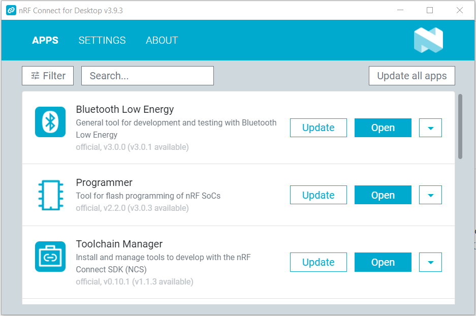

The Toolchain Manager will launch in a new window, as below:

Install the latest version of the nRF Connect SDK (Currently 1.9.1). Once the SDK is installed, an “Open VS Code” and an “Open Segger Embedded Studio” button will appear next to the SDK.

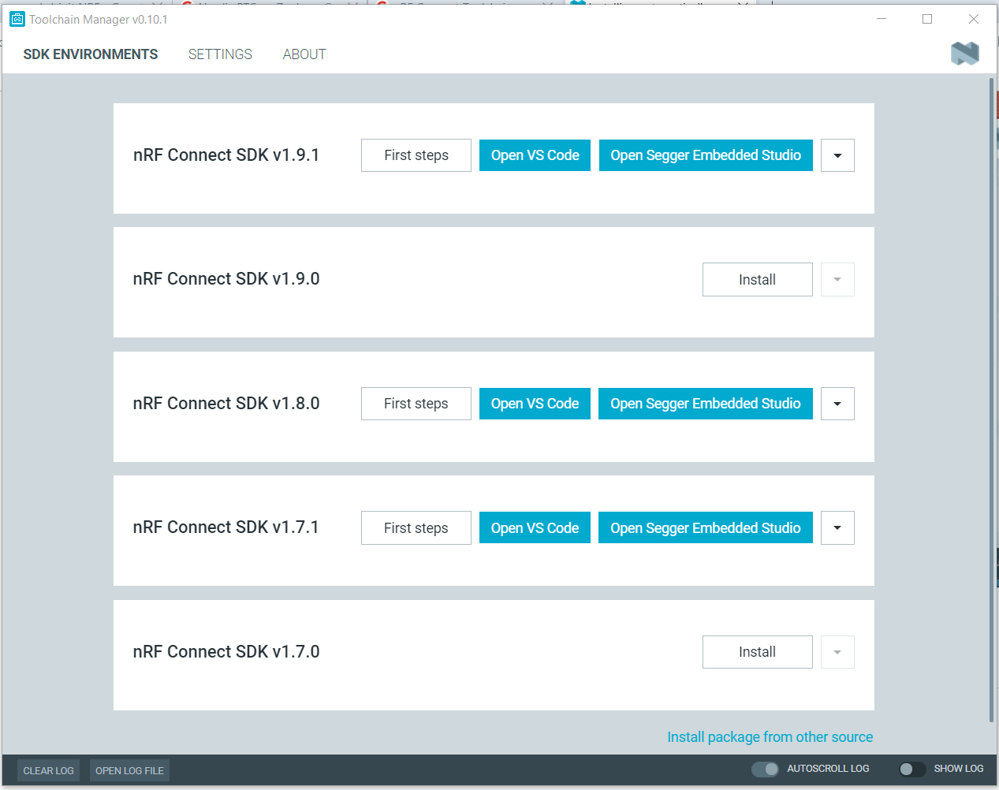

We will use VS Code in this document. Clicking on VS Code will open the VS Code IDE with the NRF Connect plugin installed, if it is already installed on the computer, otherwise it will prompt you to download and install VS Code from:

<https://code.visualstudio.com/download>

# Installing COINES for Zephyr

COINES for Zephyr can be downloaded as a zip file from the Bosch Sensortec website.

<https://www.bosch-sensortec.com/products/downloads/>

It should be unzipped in the user’s Zephyr application directory. In this document, this is assumed to be a directory called “app” in the nRF Connect SDK directory. So, if nRF Connect SDK is installed in \\ncs, the COINES for Zephyr should be unzipped in \\ncs\\app. The diagram in the following section explains the directory structure.

# Application Directory Structure

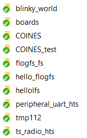

This is the application directory structure that we use for this document. These are some of the key directories:

| \\ncs                 | By default, this is the root directory for the nRF Connect SDK                                                                                                                                                                                                        |
|-----------------------|-----------------------------------------------------------------------------------------------------------------------------------------------------------------------------------------------------------------------------------------------------------------------|
| \\ncs\\vx.y.z         | nRF Connect SDK sub directory for version x.y.z (here, 1.9.1)                                                                                                                                                                                                         |
|                       | The subdirectories nrf and nrfxlib contain the Nordic-specific extension modules to Zephyr                                                                                                                                                                            |
| \\ncs\\vx.y.z\\zephyr | Root directory of Zephyr, compatible with vx.y.x of nRF Connect SDK                                                                                                                                                                                                   |
| \\ncs\\app            | Default location of application directory. You can unzip the COINES for Zephyr zip package downloaded from the Bosch Sensortec here                                                                                                                                   |
|                       |                                                                                                                                                                                                                                                                       |
|                       | **Subdirectories in COINES for Zephyr package**                                                                                                                                                                                                                       |
| COINES                | Source code files of COINES for Zephyr. Note that COINES for Zephyr is only delivered in source code form. It has to be included and built with the user applications.                                                                                                |
| COINES_test           | Sample application / test application for COINES for Zephyr, which exercises the complete COINES API                                                                                                                                                                  |
| flogfs_fs             | FLOG File System sources, with wrapper files to convert it into a Zephyr compatible file system. These source files also need to be included in user applications that wish to access the external NAND Flash on Bosch Sensortec Application Boards as a file system  |
| hello_flogfs          | Sample Application / Test Application for demonstrating a Zephyr application that uses FLOG file system. This is a non-COINES application.                                                                                                                            |
| hello_littlefs        | Sample Application / Test Application for demonstrating a Zephyr application that uses the LittleFS file system. LittleFS is an alternative to FLOG FS, and comes as a part of nRF Connect SDK. This is a non-COINES application.                                     |
| boards                | Zephyr DTS files for Bosch Sensortec Application Boards. These DTS files are required for building Zephyr applications for Bosch Sensortec Application Boards (COINES and non-COINES)                                                                                 |
| blinky_world          | A non-COINES sample that combines Blinky and Hello World on Bosch Sensortec Application Board 3.0                                                                                                                                                                     |
| tmp112                | A non-COINES sample that demonstrates using the on-board temperature sensor of Sensortec Application Board 3.0                                                                                                                                                        |
| peripheral_uart_hts   | A non-COINES sample that demonstrates USB UART and BLE ACM and BLE services on Bosch Sensortec Application Board 3.0                                                                                                                                                  |
| ts_radio_hts          | A non-COINES sample that demonstrates using the NRF52 radio-timeslot feature on Bosch Sensortec Application Board 3.0                                                                                                                                                 |

# Building a COINES for Zephyr application

## Setting the Board Root

Before creating the first COINES for Zephyr application (or even a non-COINES Zephyr Application for a Bosch Sensortec Application Board), it is necessary to make a change to the setting of VS Code (this has to be done only once).

Basically, the Zephyr build system needs to know the location of the Bosch Sensortec Application Board DTS files. By default, the Zephyr build system expects to find all DTS files in the zephyr\\boards folder. Since our DTS files are not (yet) integrated into Zephyr, and are packaged along with the application in what is known in Zephyr terminology as Out-of-Tree configuration, the location of these DTS files has to be explicitly passed on to the build system.

The simplest way to do this is to start VS Code, and then click on the Settings button, and then select the nRF Connect/ Board Roots configuration Item (see diagram)

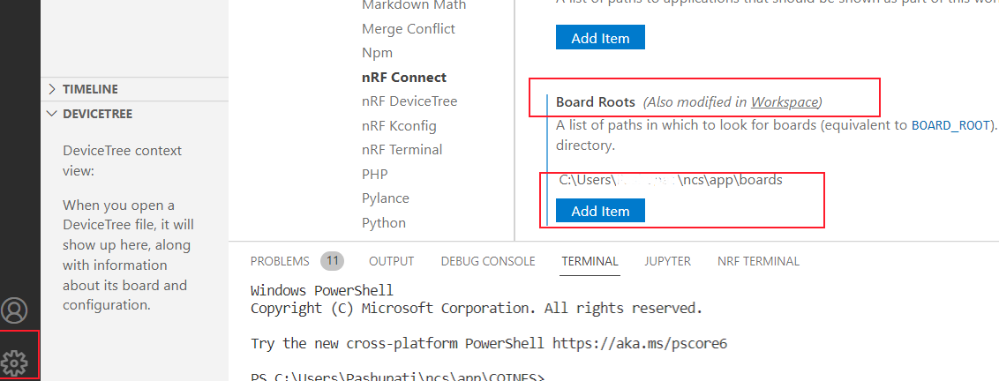

Click on Add Item and browse to the boards folder which is a part of the COINES for Zephyr package. If the package has been installed in the recommended location, this would be \\ncs\\app\\boards

Alternatively, it is also possible to set this path by setting the BOARD_ROOT variable in the CMake file of each application, CMakeLists.txt (see next section).

## Create a new Application

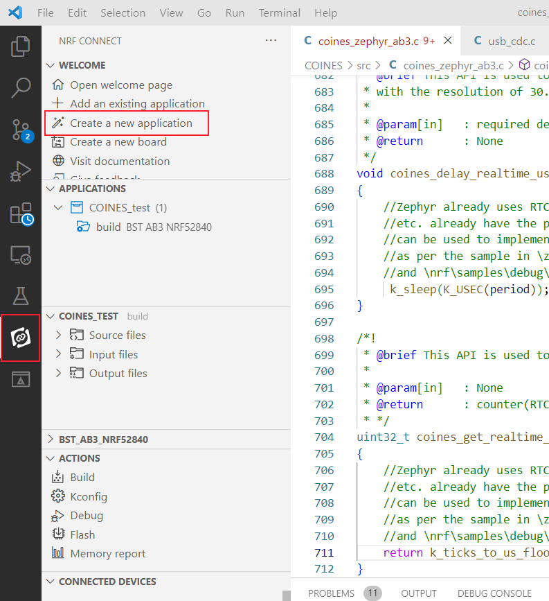

1.  Start VS Code.
2.  Click on the nRF Connect Plugin Button 
3.  Click on the “Create a new application” in the Welcome menu of nRF Connect Plugin.

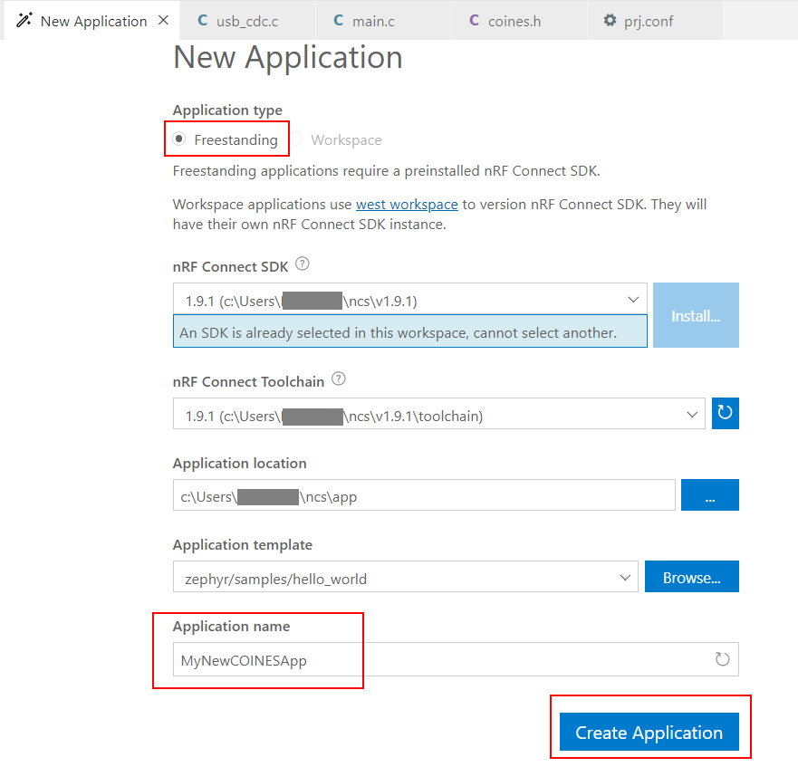

In the New Application window, make following settings:

1.  Select Freestanding application
2.  Verify location of nRF Connect SDK is correct, as previously installed
3.  Verify location of toolchain
4.  Select application location as \\ncs\\app (i.e. where the COINES for Zephyr package was unzipped. It is assumed that this has been done in a folder called app in the nRF Connect SDK folder. This is the setup being followed in this document. If you prefer to do it in some other location, please make necessary modifications.
5.  Select a Zephyr sample to act as a template for the new project. The Zephyr Hello World sample is default, and is adequate for a simple application.
6.  Enter the application name. Here we use “MyNewCOINESApp”
7.  Click on Create Application. A new application is created, as follows:

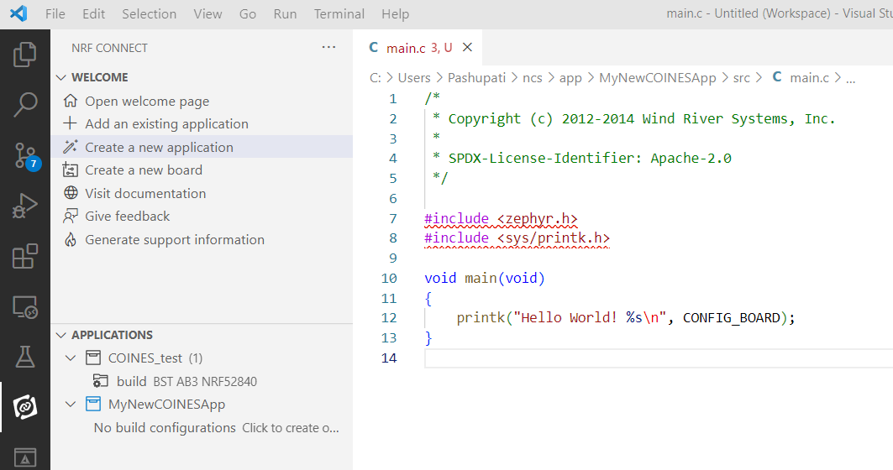

Make the following changes to *main.c*, to create a simple COINES application:

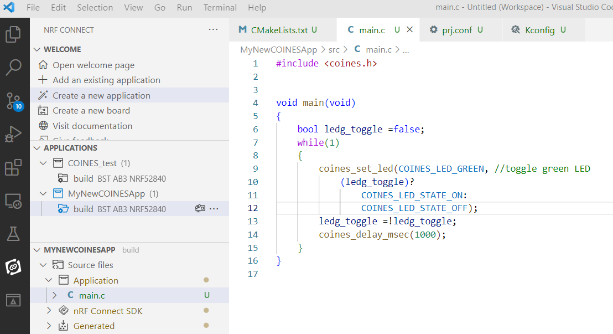

Make the following changes to *CMakeLists.txt*, in the project root folder

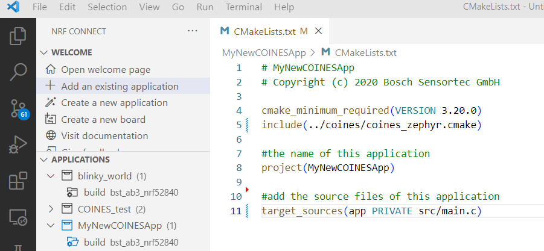

The main change is that the COINES CMake file is included in the project. This pulls in all the settings required for COINES.

NOTE2: in the above CMakelists.txt, it is assumed that the COINES folder is alongside the application project folder in the app directory. If this is not the case, the path has to be appropriately modified.

Modify the *KConfig* file as follows (this pulls in the COINES config variable definitions):

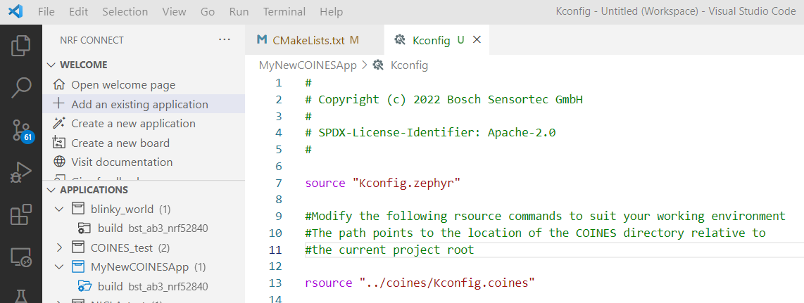

NOTE: in the above *Kconfig*, it is assumed that the COINES folder is alongside the application project folder in the app directory. If this is not the case, the paths in the above rsource commands has to be appropriately modified.

## Create a Build Configuration

The final step before building the new application is to create a build configuration suitable for the target board.

In the menu of the nRF Connect plugin, under the project, click on the “Add Build Configuration” button next to the project name, or on the highlighted text in the below screenshot:

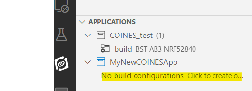

The Build Configuration window will open.

**Example1 (for Application Board 3):** Click on “Custom boards”, and select an appropriate custom board from the drop-down list. For example, for **Bosch Sensortec Application Board 3.0**, the corresponding board definition is **bst_ab3_nrf52840.**

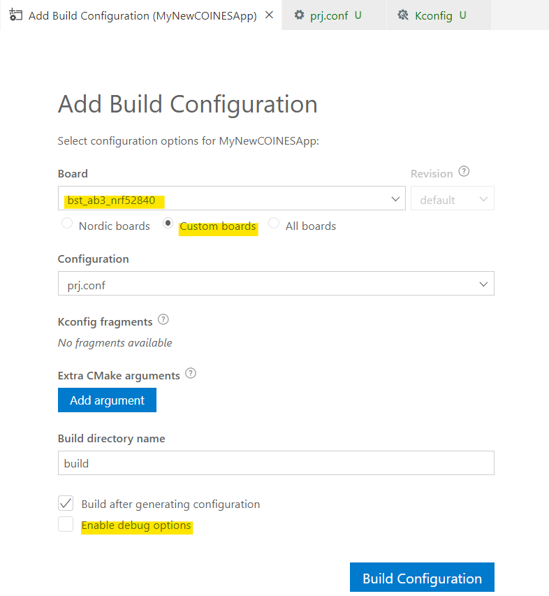

Click on “Enable debug options” to add debug information to the generated output (required for using debugger).

Click on Build Configuration to generate the necessary build files.

**TROUBLESHOOTING**: the list of custom boards is taken from the BOARD_ROOT global variable which was set in STEP 1 of this procedure. If you do not see any custom boards, there could be an error in setting the BOARD_ROOT variable. Please cross-check if the path to the Bosch Sensortec Board definition files (DTS files) is set properly in BOARD_ROOT. You may need to restart VS Code after making any changes to BOARD_ROOT.

**TIP:**

It is also possible to directly set the BOARD_ROOT variable and even the BOARD variable in the CMakeListes.txt file.

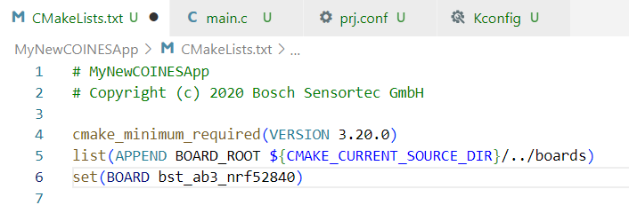

However, this is NOT RECOMMENDED, as it would make the project dependent on this one board, and this line would have to be edited manually if you wish to build for another target at a later date. In case of the previously discussed procedure, you can add multiple build configurations to project in VS Code, and build for one or more boards simultaneously.

Once the build configuration is done, it will appear under the project in the nRF Connect SDK menu. The “Add new Build Configuration” can be clicked to add further build configurations, e.g. for other target boards.

**Example2 (for NICLA):**

For the NICLA board, there is already a DTS definition in V2.0.1 and higher versions of nrfConnect/Zephyr. So, select “Nordic Boards” in the previous build configuration dialog, and select the board arduino_nicla_sense_me. The rest of the steps are the same.

Note that there is a COINES specific overlay for this board, which is available in the abovementioned boards directory. However, it is automatically loaded when you select arduino_nicla_sense_me and the BOARDS_ROOT is correctly set. So no specific action is required from the user.

## Build the Application

To build the application, click on the Build option in the nRF Connect menu.

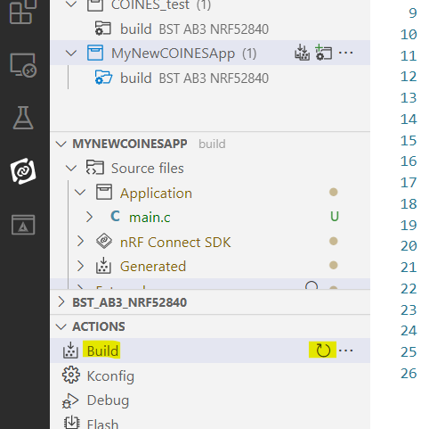

TIP: In order to do a pristine build (delete all previous output files and rebuild all), hover the mouse on the build option until the circular arrow appears (see the screenshot above), and click on the circular arrow.

## Run the Application

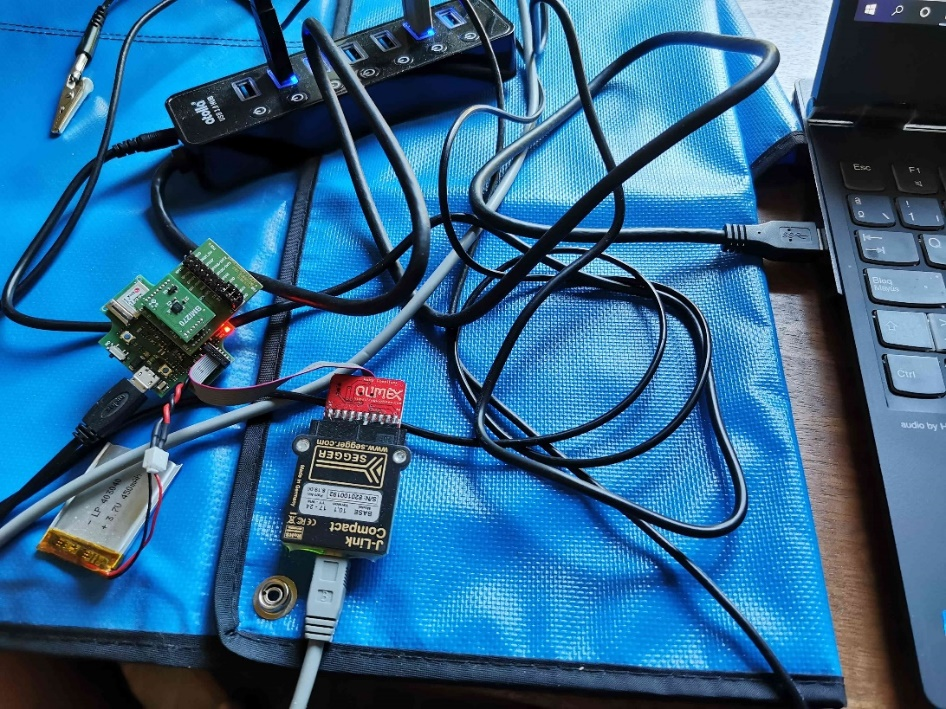

To flash and run the application on Application Board 3.0, connect a Segger J-Link debug probe to the board, as shown in the above picture, and connect the probe to the PC. When the probe is connected, the board should appear in the nRF Connect Menu under the Connected Devices menu.

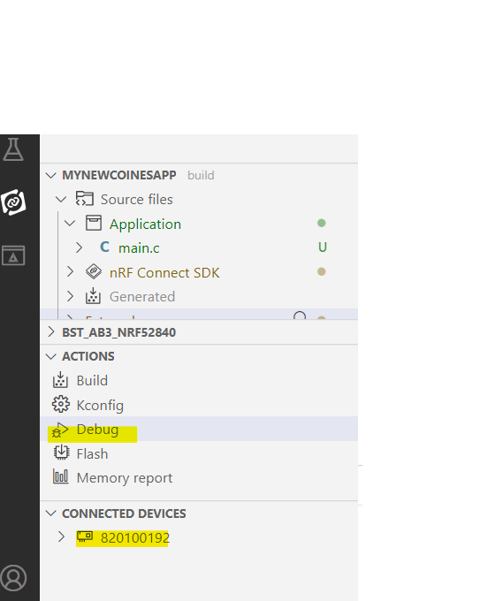

Click on Debug to flash and run the application on the board.

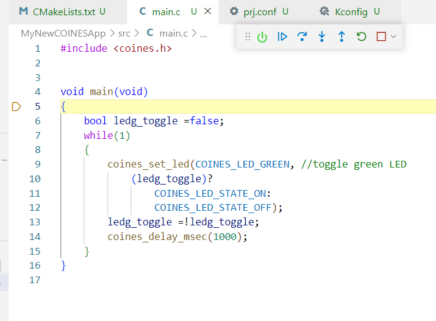

Click on the arrow button on the debugger toolbar to run the application. The green LED on the Application Board 3.0 should begin flashing.

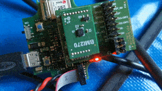

# Further Enhancements

1.  The project COINES_Test can be studied to see how the rest of the COINES API is used, and it can be used to enhance this simple application.
2.  The Zephyr user guide can be studied, as well as the various samples in Zephyr/samples, and these can be used to extend the application with Zephyr features like threads, queues etc., which is the main benefit of using COINES for Zephyr as opposed to plain-vanilla COINES.

# Deviations from Standard COINES

An attempt has been made to implement COINES for Zephyr as a 1:1 replacement for standard COINES. However, it has been necessary to take the following deviations:

1.  BLE transmission power cannot be set by the API *coines_ble_config()*. The tx_power element of the config structure is ignored. Instead, the transmission power has to be set by setting one of the CONFIG_BT_CTLR_TX_PWR_\* configuration variables to “y” in *conf.prj*

    Example (in conf.prj)

    CONFIG_BT_CTLR_TX_PWR_0=y \#0Db This is default

    Other possibilities are CONFIG_BT_CTLR_TX_PWR_MINUS_12, CONFIG_BT_CTLR_TX_PWR_MINUS_16 … upto CONFIG_BT_CTLR_TX_PWR_PLUS_8. Refer the below link for a complete list:

<https://docs.zephyrproject.org/3.0.0/reference/kconfig/index-all.html>

1.  COINES_SPI_BUS_0 is mapped to NRF SPI2 and COINES_SPI_BUS_0 is mapped to NRF SPI3 in the default configuration (see next section). This is done to avoid conflicts with I2C0 and 1, which cannot be enabled at the same time with SPI0 and 1. I2C0 and 1 are required for other purposes. All these details are noted in the DTS file.
2.  Due to the design of the Zephyr Build System, it is not possible to select at runtime which I2C and SPI ports are to be used for communication with the shuttle board, as is possible with standard COINES. It needs to be defined statically by selecting the appropriate board DTS and overlay, the so-called board revision number. This is explained in more detail in the next section.

# Note on Revisions

When creating a build configuration for the application (see previous section, “create a build configuration”), it is possible to select a so-called board-revision.

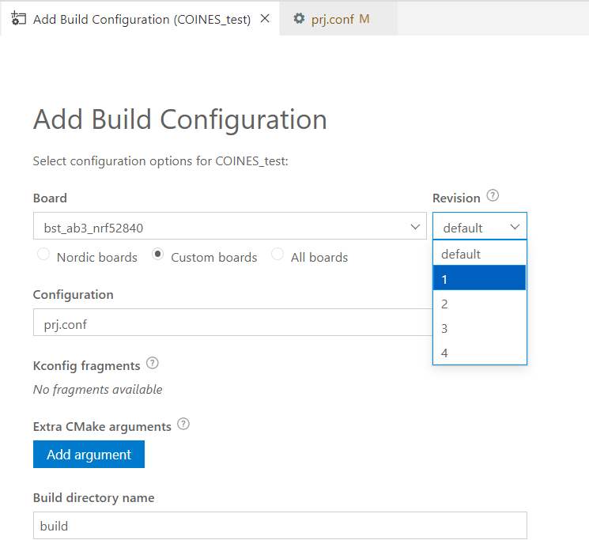

There are multiple alternative overlay DTS files for AB3.0 for different project configurations. Each alternative allocates the I2C and SPI modules for the shuttle board ports in a different way (in terms of pin allocation). Each overlay corresponds to a so-called "revision number". The project should be built with the revision number that corresponds to its configuration. Note that "Revision" here actually means "alternative configuration" as per the terminology used in the Zephyr Build System

| **Revision** | **i2c1**         | **spi1**         | **spi2**                   |
|--------------|------------------|------------------|----------------------------|
|  1           | primary_i2c_port | disabled         | primary_spi_port [DEFAULT] |
|  2           | primary_i2c_port | disabled         | aux_spi_port               |
|  3           | aux_i2c_port     | disabled         | primary_spi_port           |
|  4           | disabled         | primary_spi_port | aux_spi_port               |

Revision 1 is used by default if no revision is selected in the build. In this configuration the primary port of the shuttle can be either I2C or SPI. The application code can decide at runtime which port is to be used (note that both cannot be used simultaneously, due to the design of the sensors. This is compatible with applications written for V2.6 and older of COINES. The downside of this configuration is that the so-called "auxiliary ports" are not available (i.e., the OIS interface or external temp sensor on some shuttle boards.)

Configurations 2, 3 and 4 are useful if access to the auxiliary ports is required. These are accessed by using the COINES_SPI_BUS_1 and COINES_I2C_BUS_1 as first argument to the COINES I2C and SPI API. using these arguments results in a runtime error in the default configuration, or in a configuration where one or the other is not supported.
