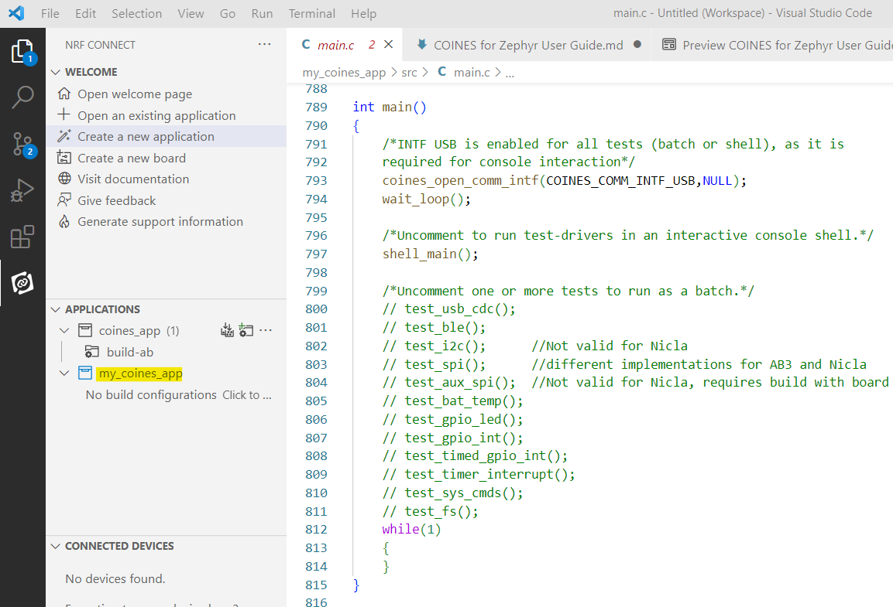
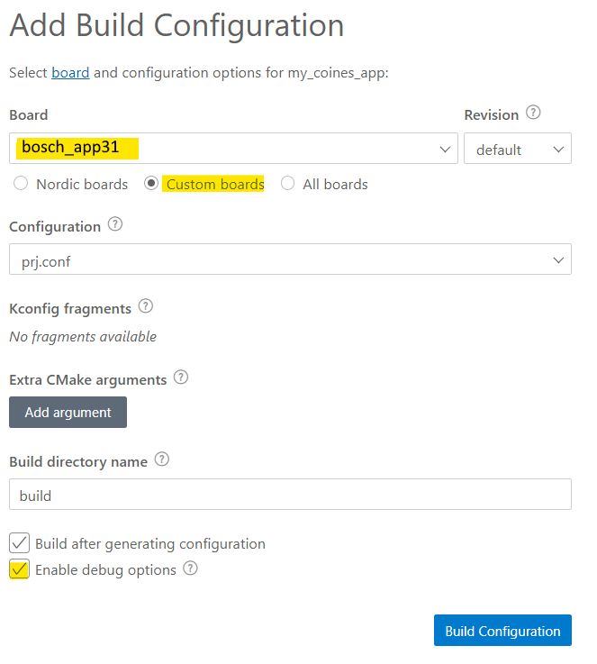
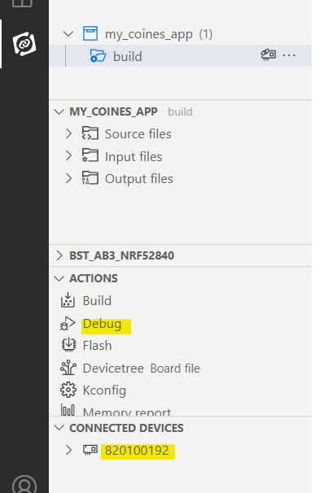

# COINES for Zephyr User Manual

**Bosch Sensortec GmbH**

## Contents

[Introduction](#introduction)

[Zephyr and nRF Connect SDK Background](#zephyr-and-nrf-connect-sdk-background)

[Bosch One Module](#bosch-one-module)

[Installing Bosch One](#installing-bosch-one)

[Building a COINES for Zephyr application](#building-a-coines-for-zephyr-application)

[Create a new Application](#create-a-new-application)

[Create a Build Configuration](#create-a-build-configuration)

[Build the Application](#build-the-application)

[Run the Application](#run-the-application)

[Further Enhancements](#further-enhancements)

[Deviations from Standard COINES](#deviations-from-standard-coines)

[Note on Revisions](#note-on-revisions)

[Customization](#customization)

# Introduction

COINES for Zephyr (aka Z-COINES) is an implementation of the COINES API on the Zephyr RTOS. Refer the COINES User Manual (Document Number BST-DHW-AN013) for more information about COINES. This document does not provide detailed information about COINES. It only provides the additional information required for using installing and using the Zephyr version.

The original COINES library is a bare-metal implementation over the microcontroller SOC. COINES for Zephyr on the other hand is layered on top of the Zephyr RTOS and uses many Zephyr kernel features such as threads, queues etc., as well as the Zephyr communication interface for USB, BLE, I2C, SPI etc.

The advantage of using COINES for Zephyr for a user application is that all of the powerful features of the Zephyr RTOS are available to the user application, while allowing an easy path for porting existing COINES-based application code. Using COINES for Zephyr, an existing COINES user application should normally build and run in the Zephyr environment without any changes to the source code, provided the user application does not use microcontroller-specific features, i.e., if it is a pure-COINES application.

# Zephyr and nRF Connect SDK Background

Zephyr is a small, modular RTOS for resource-constrained embedded environments such as IoT. It is open-source, available on GitHub, and is supported by an active community and a consortium of leading semiconductor manufacturers such as Intel, Nordic, NXP etc.

The Zephyr documentation is available at this url:

<https://docs.zephyrproject.org/latest/introduction/index.html>

Zephyr Getting Started guide. This link is provided only for general information. DO NOT follow the installation instructions on this link. Please see installation instructions in the next section:

<https://docs.zephyrproject.org/latest/getting_started/index.html>

The below link contains important information on the structure of a Zephyr application. It is useful to read this before porting a COINES application to COINES for Zephyr.

<https://docs.zephyrproject.org/latest/application/index.html>

COINES for Zephyr does not use bare-bones Zephyr, but a customized version that comes as a part of Nordic nRF Connect SDK.

<https://developer.nordicsemi.com/nRF_Connect_SDK/doc/latest/nrf/index.html>

nRF Connect SDK is a complete embedded systems development environment for Nordic microcontrollers (The Bosch Sensortec Application Boards currently use Nordic NRF 5284x microcontrollers). The installation package contains the VS Code open-source IDE with a proprietary nRF Connect plugin, the latest Zephyr repository, along with Nordic-specific enhancements nrf and nrfxlib.

COINES for Zephyr applications are expected to be built in the nRF Connect environment using VS Code. This document will only discuss this scenario.

The documentation for nRF Connect SDK, nRF52 Series, Nordic tutorials, blogs and other related tools is available here:

<https://infocenter.nordicsemi.com/index.jsp>

# Bosch One Module

Bosch One is the Bosch Sensortec External Module for Zephyr. A Zephyr External Module is an external repository that integrates with Zephyr, but is not a part of the Zephyr upstream repository. External repositories are usually located in the parent directory of Zephyr. For example, if Zephyr is installed in */ncs/v2.3.0/zephyr*, Bosch-One is installed in */ncs/v2.3.0/bosch-one*.

Bosch One contains all the Zephyr-related Bosch Sensortec software infrastructure. This includes COINES for Zephyr (Z-COINES). It also contains libraries, sensor drivers, utility drivers, documents etc. Z-COINES sources are available under */bosch-one/lib/COINES*. Z-COINES samples are available under */bosch-one/samples/coines*

# Installing Bosch One

The procedure for installing Bosch One, along with VS Code, nRF Connect and Zephyr, is explained in a separate document *Bosch One Installation Guide* which is available on the Bosch Sensortec download page.

<https://www.bosch-sensortec.com/products/downloads/>

The above document is also available in the Bosch-One repository in the Bosch Sensortec home page on GitHub:

<https://github.com/BoschSensortec>

The following sections assumes that the Bosch-One module is correctly installed on the system along with Zephyr, nrf Connect SDK, VS Code, and nrf Connect plugin for VS Code, as described in the above document. It is also assumed that the paths for nrF Connect SDK and Toolchain are correctly set in the VS Code settings, as described in the above document.

## Default Directory Structure

Following is the default directory structure if Bosch One is installed as per default settings. vx.y.z is the nrf Connect SDK / Bosch-One version number.
```
ncs
├── app                     User Applications (recommended location)
│   ├── proj1               user application 1
│   ├── proj2               user application 2
│   ├── ...
├── v2.0.3
│   ├── bosch-one           Bosch One module
│   ├── nrf                 Nordic nrf module
│   ├── nrfxlib             Nordic nrfx module
│   ├── modules             Other external modules
│   ├── zephyr              Zephyr root directory
```
# Building a COINES for Zephyr application

## Create a new Application


1.  Start VS Code.
2.  Click on the nRF Connect Plugin Button 
3.  Click on the “Create a new application” in the Welcome menu of nRF Connect Plugin.


In the New Application window, make following settings:

1.  Select Freestanding application
2.  Verify location of nRF Connect SDK, as installed in previous step
3.  Verify location of toolchain, as installed in previous step
4.  Select an appropriate application location. By convention, it should be in a parent directory of bosch-one. In this document, the application directory is presumed to be *ncs/app*, as shown in the previous section.
5.  Select a Z-COINES sample to act as a template for the new project. The *coines_app* sample is a good starting point for general-purpose COINES applications. One of the COINES sensor samples is a good starting point for sensor applications.
6.  Enter the application name. Here we use "my_coines_app”
7.  Click on Create Application. A new application is created, as follows:



If *coines_app* has been used as a template, the newly created app already has a number of functions in *main.c* to demonstrate the use of different parts of the COINES API such as GPIO, SPI, I2C etc. It is sufficient to build this app and run it as explained in the next section in order to experiment with the basic features of COINES and the Bosch Sensortec application boards. These functions can also form the basis of your own COINES application.

## Create a Build Configuration

The final step before building the new application is to create a build configuration suitable for the target board.

In the menu of the nRF Connect plugin, under the project, click on the “Add Build Configuration” button next to the project name, or on the highlighted text in the below screenshot:


The Build Configuration window will open.

Click on “Custom boards”, and select a custom board supported by Bosch One from the drop-down list.

For example:
- **bosch_app30** for **Bosch Sensortec Application Board 3.0**
- **bosch_nicla_sense** for **Arduino Nicla Sense ME**



Click on “Enable debug options” to add debug information to the generated output (required for using debugger).

Click on Build Configuration to generate the necessary build files.

**TROUBLESHOOTING**: the list of custom boards is taken from the board definitions available in *bosch-one/boards*. If you do not see any custom boards, it could be due to the fact that Bosch One is not properly installed. You can try reinstalling Bosch One. Otherwise, a workaround is to directly set the BOARD_ROOT global CMake variable, as explained in the Bosch One Installation Guide.
This is the procedure:
- Click on the *VS Code* Settings Icon at the bottom-Left of the window
- In the search box, enter *nrf-connect.boardRoots*
- Click on *Add Item*, and enter the following text: *${config:nrf-connect.topdir}/bosch-one/*


## Build the Application

After clicking on the *Build Configuration* button in the Build Configuration window, the build is launched. If it is successful, the build configuration will appear under the project in the nRF Connect SDK menu. The “Add new Build Configuration” can be clicked to add further build configurations, e.g. for other target boards.


To re-build a configuration e.g. after code changes, click on the desired build configuration to activate it (the active configuration is marked blue), and click on the build button in the left pane as shown in above screen shot.

*TIP:* In order to do a pristine build (delete all previous output files and rebuild all), hover the mouse on the build option until the circular arrow appears (see the screenshot above), and click on the circular arrow.

# Run the Application
## Run the Application (for Application Board 3.0)


To flash and run the application on Application Board 3.0, connect a Segger J-Link debug probe to the board, as shown in the above picture, and connect the probe to the PC. When the probe is connected, the board should appear in the nRF Connect Menu under the Connected Devices menu.



Click on Debug to flash and run the application on the board.


Click on the arrow button on the debugger toolbar to run the application. 

To view the console output from the program,  run a suitable USB console app such as HTERM.


Ensure that the HTERM settings match the ones in the above screenshot, specifically the highlighted settings. In case the *coines_app* sample has been flashed, and the default *shell_main()* demo function is activated, the above menu output will appear in the console after ENTER is pressed in the *Input Control* pane of HTERM. Note that initially there will be no output in the console, as the *coines_app* sample program waits for an ENTER to be pressed in the console.

Once the above menu appears, a number corresponding to a test number can be entered in HTERM to run a particular test. The display prompts in the console window guide the user for each test.

## Run the Application (for Nicla Sense ME)


In case of the Arduino Nicla Sense ME board, the board is connected directly to the PC via USB for debugging. It has an on-board debugger. It is neither possible nor required to use Segger J-Link debug probe.

Also in case of Nicla, it is necessary to have a file called *launch.json* in a directory called *.vscode* in the project root directory. This file is already present in the template sample *coines_app*, and in various other Bosch One samples that are valid for Nicla. In case it is absent, it can be copied from one of the Bosch-One samples, otherwise it can be created from scratch based on the details provided in the Bosch-One Installation Guide.

For Nicla, it is not possible to use the Debug button of the nrf Connect plugin, as it assumes the presence of Segger Jlink. Instead, it is necessary to use the native debug window of VS Code


Click on the "bug" icon in the left control bar to switch to the native debug window on VS Code. In the top combo box, select the Nicla app that has been built, and click on the go arrow to launch the debugger. 

The rest of the details are the same as that for Application Board 3.0

# Further Enhancements

1.  The various demo functions in *coines_app* can be studied to see how the COINES API is used, and it can be used to create more complex COINES applications.
2.  The Zephyr user guide can be studied, as well as the various samples in Zephyr/samples, and these can be used to extend the application with Zephyr features like threads, queues etc., which is the main benefit of using COINES for Zephyr as opposed to bare-metal COINES.

# Deviations from Standard COINES

An attempt has been made to implement COINES for Zephyr as a 1:1 replacement for standard bare-metal COINES. However, it has been necessary to take the following deviations:

1.  BLE transmission power cannot be set by the API *coines_ble_config()*. The tx_power element of the config structure is ignored. Instead, the transmission power has to be set by setting one of the CONFIG_BT_CTLR_TX_PWR_\* configuration variables to “y” in *conf.prj*

    Example (in conf.prj)

    CONFIG_BT_CTLR_TX_PWR_0=y \#0Db This is default

    Other possibilities are CONFIG_BT_CTLR_TX_PWR_MINUS_12, CONFIG_BT_CTLR_TX_PWR_MINUS_16 … upto CONFIG_BT_CTLR_TX_PWR_PLUS_8. Refer the below link for a complete list:

<https://docs.zephyrproject.org/3.0.0/reference/kconfig/index-all.html>

1.  COINES_SPI_BUS_0 is mapped to NRF SPI2 and COINES_SPI_BUS_0 is mapped to NRF SPI3 in the default configuration (see next section). This is done to avoid conflicts with I2C0 and 1, which cannot be enabled at the same time with SPI0 and 1. I2C0 and 1 are required for other purposes. All these details are noted in the DTS file.
2.  Due to the design of the Zephyr Build System, it is not possible to select at runtime which I2C and SPI ports are to be used for communication with the shuttle board, as is possible with standard COINES. It needs to be defined statically by selecting the appropriate board DTS and overlay, the so-called board revision number. This is explained in more detail in the next section.

# Note on Revisions

When creating a build configuration for the application (see previous section, “create a build configuration”), it is possible to select a so-called board-revision.


There are multiple alternative overlay DTS files for AB3.0 for different project configurations. Each alternative allocates the I2C and SPI modules for the shuttle board ports in a different way (in terms of pin allocation). Each overlay corresponds to a so-called "revision number". The project should be built with the revision number that corresponds to its configuration. Note that "Revision" here actually means "alternative configuration" as per the terminology used in the Zephyr Build System

| **Revision** | **i2c1**         | **spi1**         | **spi2**                   |
|--------------|------------------|------------------|----------------------------|
|  1           | primary_i2c_port | disabled         | primary_spi_port [DEFAULT] |
|  2           | primary_i2c_port | disabled         | aux_spi_port               |
|  3           | aux_i2c_port     | disabled         | primary_spi_port           |
|  4           | disabled         | primary_spi_port | aux_spi_port               |

Revision 1 is used by default if no revision is selected in the build. In this configuration the primary port of the shuttle can be either I2C or SPI. The application code can decide at runtime which port is to be used (note that both cannot be used simultaneously, due to the design of the sensors. This is compatible with applications written for V2.6 and older of COINES. The downside of this configuration is that the so-called "auxiliary ports" are not available (i.e., the OIS interface or external temp sensor on some shuttle boards.)

Configurations 2, 3 and 4 are useful if access to the auxiliary ports is required. These are accessed by using the COINES_SPI_BUS_1 and COINES_I2C_BUS_1 as first argument to the COINES I2C and SPI API. using these arguments results in a runtime error in the default configuration, or in a configuration where one or the other is not supported.

# Customization

The *coines_app* sample comes with a *prj.conf* Zephyr project customization file that is suitable for most Z-COINES applications. It is possible to customize this file as per project requirements. For example, one can switch off the BLE or USB stacks if not required, thereby reducing image size and improving runtime performance. One can modify the BLE advertising power, the default BLE device name etc.

The *prj.conf* file is liberally commented to guide the user in doing such customizations. It is necessary to do a pristine build of the application after modifying the configuration file.